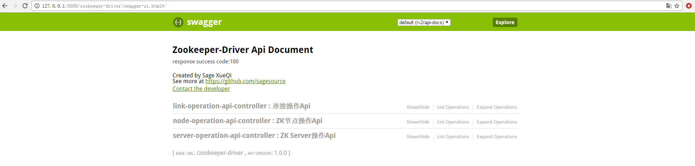
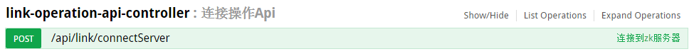
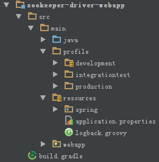

# zookeeper-driver
## 项目介绍
平时在学习使用Zookeeper时,总是需要登录到虚拟机,进入控制到输入命令操作节点.
    
在命令逐渐熟悉后,其实是一个很耽误时间的过程,由此打算开发一套简单实用的Zookeeper管理平台,本工程是API接口工程
    
同时,在开发这套平台的时候,希望他可以做到"开箱配置即可用"的状态,所以在设计上,更多的考虑到一些配置的灵活性和持久性:
    
- 将Zookeeper的连接配置持久化到数据库中,管理员在系统第一次使用的时候可以先初始化信息.未来规划是提供一个安装平台进行首次部署

- 前后分离的模式,可以根据现有API进行功能化开发
        
## 技术选型
- JDK:1.8 (因为部分代码使用了lambda表达式,所以一定要使用JDK1.8)

- Zookeeper版本:3.4.9

- Zookeeper客户端:curator2.11.1 (该版本使用的zookeeper与服务器版本相同,这里就要注意本地zk客户端的版本号一定要和服务器zk的版本相匹配)

- 构建工具:Gradle3.2.1 (工程集成了gradlew,可以直接使用)

- 数据库:MySQL

- Spring4.3.3 MyBatis3.4.1 

- 池技术:Apache Commons-pool2 2.4.2 

## 快速开始
### 常用命令
- Gradle打包:gradle clean war -Dprofile=环境名称(development/integrationtest/production)

### war包部署方式(以打development环境的包为例)
- 修改tomcat的catalina.bat(Linux为catalina.sh),为JAVA_OPTS添加参数 -Dspring.profiles.active=development

- 执行项目根路径db目录的sql文件,会自动创建zk_driver数据库,并导入测试初始数据

- 修改host文件,将zk.sagesource.com映射到自己的zk服务器ip;或修改

- 修改zookeeper-driver-webapp/development/development的jdbc-development.properties配置文件.修改数据库连接 用户名 密码等

- 在项目的根路径执行gradle的打包命令  
    `./gradlew war -Dprofile=development`
    
- 进入zookeeper-driver-webapp/build/libs文件夹将生成的war包copy到tomcat的webapps目录下,可以重命名为任意名称,这里以zookeeper-driver为准

- 启动Tomcat,在地址栏中输入 http://localhost:port/zookeeper-driver/swagger-ui.html ,看到如下页面:

### API快速调用
- clientKey可以使用:120102198765 也可以修改zk_server_info表的clientKey字段

- 首先调用如图的接口,创建到指定zk的连接客户端:

- 之后可以使用该clientKey进行接口调试调用

## 开发手册
### 设计思路
1. zk连接的配置持久化到数据库中,便于集中管理多套zk服务

2. 连接到同一个zk服务的客户端,使用对象池,在第一次连接的时候创建,减小了多用户多次连接到同一服务的网络和性能开销.使用clientKey作为每一个对象池索引

3. 前后端分离(前端正在开发中),其他使用者可以根据api接口开发定制的前端页面

4. 基于Spring和Gradle的Profiles,将多套环境配置分离,便于部署运维-现在有development(开发环境)/integrationtest(测试环境)/production(生产环境)

5. 多模块构建,通用与业务无关的模块,将依赖减少到最小,便于代码的复用

6. 使用springfox(swagger)生成接口api-该功能只在开发环境

### 工程结构说明
#### zookeeper-driver-webapp

- profile文件夹:不同环境的配置文件,文件名的格式为:配置名称-环境名称.properties.(在IDE中开发时,要将需要的环境目录输出到WEB-INF/classes中)

- resources文件夹:所有环境通用的配置在application.properties中,还有spring的配置文件

- logback.groovy:日志组件logback的配置文件

### 数据表结构

### IDE中进行开发

## 未来规划
1. 权限管理,敏感操作需要特殊权限

2. 操作日志

3. 节点权限管理(zookeeper的ACL个人认为确实是不太好用)

4. 工程初始化安装器

## 联系作者
- 邮箱:job.xueqi@gmail.com (薛琪)
